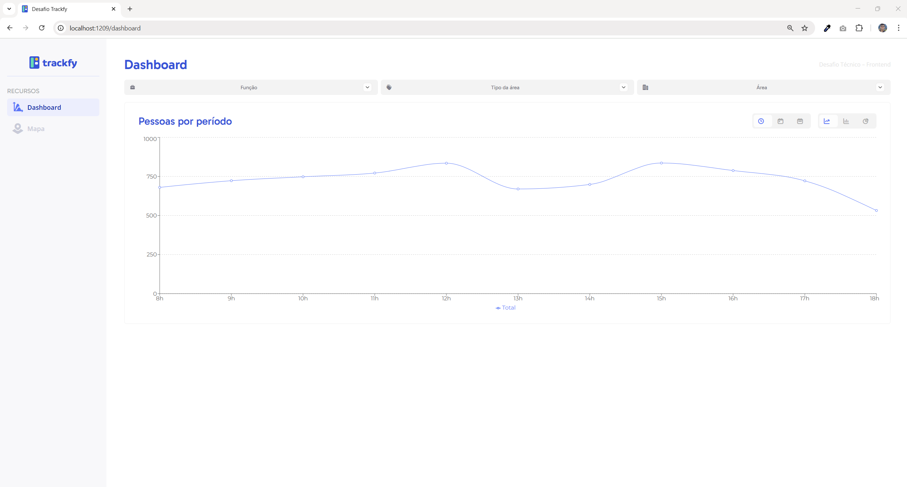

# 📊 DesafioTrackfy - Desafio Técnico Frontend 2025


Aplicação web interativa para análise e visualização de dados de colaboradores de uma empresa, desenvolvida com **React** e **Vite**. O sistema possui duas telas principais: um dashboard com gráficos dinâmicos e um mapa interativo. Os gráficos podem ser personalizados através de filtros que consideram função, área, tipo de área e período de tempo, permitindo agrupar e explorar os dados sob diferentes perspectivas. As informações são apresentadas em três formatos de gráficos: linha, barras empilháveis e pizza, utilizando a biblioteca **Recharts**.

## 🖼️ Screenshots
Veja algumas imagens das principais telas do projeto:

<div align="center">
   
   
   <details>
      <summary>Ver mais screenshots</summary>
      <br>
      
      <br><br>
      
      <br><br>
      
      <br><br>
      
   </details>
</div>

## ✨ Principais Funcionalidades

### 📈 **Dashboard**
- **Gráficos dinâmicos** com [Recharts](recharts.org).
- **Filtros personalizados** com relacionamento entre componentes.
- **Visualizações múltiplas**: gráficos de linha, barras empilháveis e pizza.
- **Análise temporal** com filtro de instantes específicos no tempo, independente do agrupamento escolhido.

### 🗺️ **Mapa Interativo**
- **Mapa interativo** com React Leaflet.
- **Marcadores circulares** representando áreas geográficas.
- **Popups informativos** com a quantidade total de pessoas por área.
- **Cores diferenciadas** por área para melhor visualização.

### 🔍 **Sistema de Filtros**
- **Filtros interdependentes**: `areaTypes` afeta dinamicamente `areaNames`.
- **Agrupamento temporal**: Exibe os dados agrupados por dias, horas ou semanas.
- **Filtro de instante temporal**: Visualize a distribuição das áreas em momentos específicos através do gráfico de pizza. 

## 🚀 Como Executar o Projeto

### 📋 **Pré-requisitos**
- Node.js (versão utilizada 20.17.0)
- npm

### 🛠️ **Instalação e Execução**

1. **Clone o repositório**
   ```bash
   git clone https://github.com/DavidOSilva/DesafioTrackfy
   cd DesafioTrackfy
   ```

2. **Instale as dependências**
   ```bash
   npm install
   ```

3. **Execute o projeto em modo de desenvolvimento**
   ```bash
   npm run dev
   ``` 

4. **Acesse a aplicação**
   - Abra seu navegador e acesse `http://localhost:1209`


## 🏗️ **Tecnologias e Ferramentas**

### 🔧 **Stack Principal**
- **React 19** - Biblioteca principal para construção da interface.
- **Vite** - Build tool moderna e rápida.
- **React Context API** - Gerenciamento de estado global que permite compartilhar dados entre componentes sem passar props.
- **CSS Modules** - Estilização componentizada e isolada.

### 📊 **Visualização de Dados**
- **Recharts** - Biblioteca para gráficos interativos. Esta é a primeira vez que utilizo esta ferramenta em um projeto.

### 🗺️ **Mapeamento**
- **React Leaflet** - Mapas interativos (escolhido por experiência prévia, apesar das limitações).
- **Leaflet** - Biblioteca base para funcionalidades de mapa.

### 🎯 **Decisões Técnicas**

- **Preservação dos dados originais**: Mantive o arquivo de dados fornecido sem modificar sua estrutura original.
- **Gráfico de barras empilháveis**: Utilizo áreas em vez de apenas totais para evitar redundância com o gráfico de linha.
- **Relacionamento de filtros**: Implementação manual do relacionamento `areaTypes` → `areaNames`.
- **Menu lateral** para navegação entre as páginas.
- **Paleta de cores** consistente com a identidade visual da Trackfy, incluindo logo e fonte oficial.

## 🔮 **Possíveis Melhorias Futuras**

- **Migração para Mapbox**: Substituir React Leaflet por Mapbox, o que permitiria mais possibilidades no mapa interativo.
- **Exportação** de gráficos em diferentes formatos, útil para construção de apresentações e relatórios.
- **Dashboard customizável** pelo usuário, talvez com mudança para tema escuro.
- **API backend** para acessar os dados de maneira dinâmica, aproximando-se mais de um projeto real.

## 🤝 **Contribuição**

Este projeto foi desenvolvido como parte de um desafio técnico, mas sugestões são sempre bem-vindas!

---

**Desenvolvido por @DavidOSilva** | **davidoliveirasilvaa@gmail.com** | **Desafio Técnico Frontend 2025**
